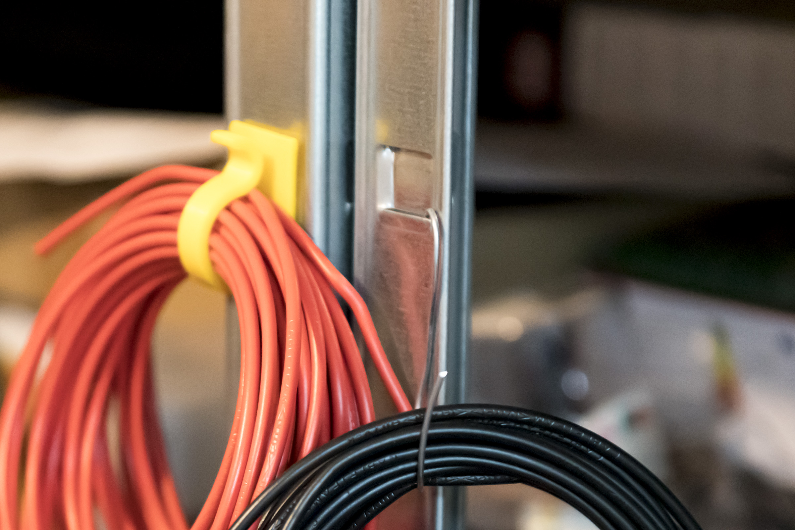

# Shelf clip
3D printable shelf plug-in clip (OBI Regal). Created witih Rhino 6.

Requirements:
* 3D printer 
* Filament of your choice

## View

## Tipp
I highly recommend to print brim. I needed 18 lines of brim to sucessfully print.
Print it upright on the side.
